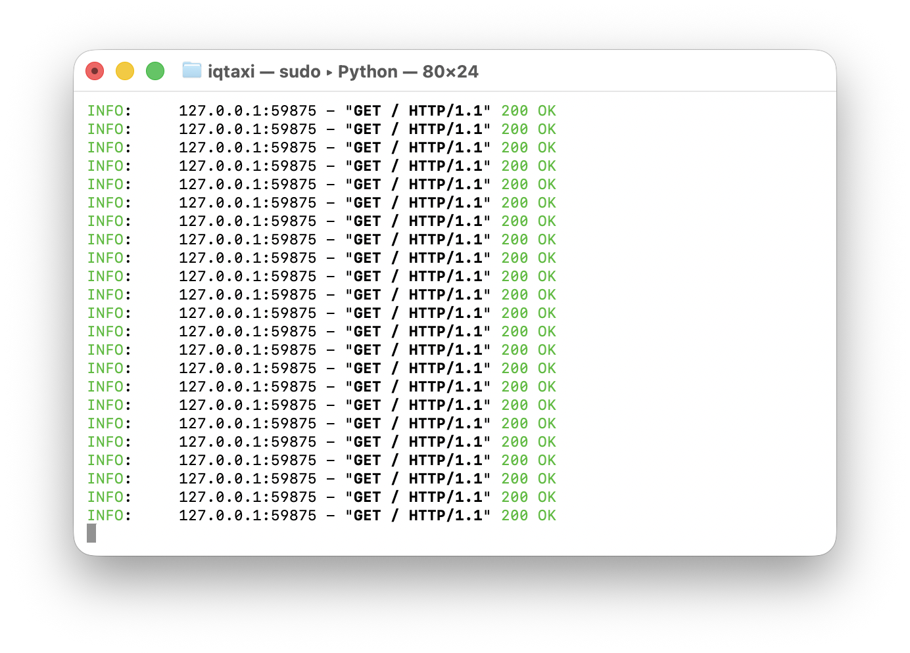

# iOS Fake GPS — a Lockito-style location simulator for iPhone

Simulate a static location **or** a moving route (with adjustable speed, looping
and GPS jitter) on a **non-jailbroken** iPhone, driven from a native macOS app.

This is the iOS counterpart to Android's **Lockito**. Unlike Android, iOS has no
public "mock location" API, so an app installed *on the phone* can't fake GPS for
other apps. Instead the spoof is driven from a tethered Mac over Apple's
**developer tunnel** — the same mechanism Xcode uses to simulate location while
debugging. The coordinate you set is seen **system-wide** by every app on the
device.


> **Use responsibly.** This is meant for testing location-aware apps you own and
> for personal use. Using it to defeat anti-cheat, commit fraud, or bypass
> location-based access controls breaks those services' terms — and possibly the
> law.

## Features

- **Teleport mode** — click anywhere (or search an address) to jump the device
  there instantly.
- **Route mode** — drop a series of waypoints and play them back as continuous
  movement.
- **Speed control** — 1–300 km/h; the app interpolates position every second so
  motion is smooth and realistic.
- **Loop** a route indefinitely.
- **GPS jitter** — add a few metres of random noise so the track doesn't look
  unnaturally perfect.
- **Address / place search** powered by MapKit.
- **Live position marker** showing exactly where the device currently reports it
  is, plus distance and ETA readouts.
- **One-click reset** back to the device's real GPS.

## How it works

```
macOS app (SwiftUI + MapKit)            Python sidecar              iPhone
  drop pins / search / route ─stdin──▶  pymobiledevice3  ──tunnel──▶  every app
  speed · loop · jitter      ◀stdout──  LocationSimulation   (DDI)     sees fake GPS
  interpolates the movement             holds 1 connection
```

- **`macapp/`** — the GUI (SwiftUI + MapKit). It owns the map, route editing and
  movement interpolation, so speed / pause / loop / jitter are all controlled on
  the Mac side rather than relying on the device's own GPX timing. It talks to
  the sidecar with newline-delimited JSON over stdin/stdout.
- **`sidecar/gpsd_helper.py`** — a small Python process that holds **one**
  developer connection open and applies each coordinate through
  `pymobiledevice3`'s `LocationSimulation` DVT channel. Keeping a single
  persistent connection avoids re-doing the slow tunnel handshake on every point
  (important when pushing a new coordinate roughly once a second).
- **`tunneld`** — `pymobiledevice3 remote tunneld`, a root daemon that creates
  the per-device RemoteXPC tunnel and auto-mounts the Developer Disk Image.
  Required on iOS 17+.

The tunnel daemon running and serving the app's requests:



## Requirements

- macOS with **Xcode** / the Swift toolchain (`swift` + `xcodebuild`).
- **Python 3.10+**.
- An iPhone on **iOS 17 or newer** with a USB cable.

## One-time setup

### 1. Python sidecar — install OUTSIDE `~/Documents`

The privileged `tunneld` daemon runs as **root**, and macOS **TCC** blocks root
from reading `~/Documents`, `~/Desktop` and `~/Downloads`. So the Python runtime
has to live somewhere root can read. Use a dot-folder in your home directory:

```bash
mkdir -p ~/.ios-fake-gps
python3 -m venv ~/.ios-fake-gps/venv
~/.ios-fake-gps/venv/bin/pip install -r sidecar/requirements.txt
cp sidecar/gpsd_helper.py ~/.ios-fake-gps/gpsd_helper.py
```

> Putting the venv under `~/Documents` makes `tunneld` die instantly with
> `PermissionError: ... pyvenv.cfg`. That's the TCC restriction at work, not a
> bug — keep the runtime in `~/.ios-fake-gps`.

### 2. iPhone

1. Connect it to the Mac by USB and tap **Trust**.
2. Enable **Settings → Privacy & Security → Developer Mode**, then reboot.

## Running

Two things need to be running: the **tunnel daemon** (root) and the **macOS
app**. The app can launch the tunnel for you (it shows the macOS password
dialog), or you can start it manually:

```bash
# Terminal 1 — keep this running. Needs sudo because it opens a network tunnel.
sudo ~/.ios-fake-gps/venv/bin/python -m pymobiledevice3 remote tunneld
```

```bash
# Terminal 2 — the GUI
cd macapp
swift run            # or: open Package.swift in Xcode and press Run
```

In the app:

1. Wait for **Tunnel daemon running** ✓ (or click **Start tunnel (admin)…**).
2. Click **Connect** — it shows the device name and iOS version.
3. **Teleport** mode: click the map (or pick a search result) to jump the device
   there instantly.
4. **Route** mode: click to drop waypoints, set the **Speed**, optionally enable
   **Loop** and **Jitter**, then press **Play**. The green marker is the live
   simulated position; the device follows it in real time.
5. **Reset device location** clears the spoof and returns the device to real GPS.

## Quick CLI sanity check (no GUI)

With the tunnel running, this teleports the device to Liberty Island:

```bash
~/.ios-fake-gps/venv/bin/pymobiledevice3 developer dvt simulate-location set -- 40.690008 -74.045843
~/.ios-fake-gps/venv/bin/pymobiledevice3 developer dvt simulate-location clear
```

If that works, the GUI will too. Open Apple Maps on the phone and tap the
location arrow to confirm.

## Project layout

```
ios-fake-gps/
├── macapp/                     native macOS app (Swift Package, SwiftUI + MapKit)
│   ├── Package.swift
│   └── Sources/FakeGPS/
│       ├── App.swift            app entry point + dependency wiring
│       ├── ContentView.swift    sidebar controls, search, transport
│       ├── MapView.swift        MKMapView wrapper (waypoints, route, marker)
│       ├── MapController.swift   map commands + MapKit place search
│       ├── SimulationEngine.swift  route interpolation, play/pause/loop/jitter
│       ├── Sidecar.swift        launches & speaks JSON to the Python helper
│       ├── TunnelManager.swift  tracks / starts the root tunnel daemon
│       ├── Geo.swift            haversine + along-path interpolation maths
│       └── AppConfig.swift      resolves the runtime location
├── sidecar/
│   ├── gpsd_helper.py          persistent location-simulation helper
│   └── requirements.txt
└── docs/                       screenshots
```

## Troubleshooting

- **"Tunnel daemon not running"** — start `tunneld` (needs `sudo`); confirm with
  `curl http://127.0.0.1:49151`.
- **`PermissionError: ... pyvenv.cfg`** — the venv is under a TCC-protected
  folder. Recreate it in `~/.ios-fake-gps` as shown above.
- **"Could not open LocationSimulation … DDI"** — Developer Mode is off, the
  device isn't trusted, or the Developer Disk Image hasn't mounted yet. Re-plug,
  trust, and give `tunneld` a few seconds to auto-mount it.
- **No device listed** — check with
  `~/.ios-fake-gps/venv/bin/pymobiledevice3 usbmux list`.
- **App can't find the sidecar** — it looks in `~/.ios-fake-gps`; the connection
  panel warns if it can't find `venv/bin/python` + `gpsd_helper.py`.

## Limitations

- The Mac must stay tethered (USB; Wi-Fi works after an initial USB pairing).
- iOS 17+ requires Developer Mode and the root `tunneld` daemon.
- This sets the reported location; it does not fake Wi-Fi or cell-tower signals,
  so a small number of apps that cross-check those may notice the mismatch.

## Built with

- [pymobiledevice3](https://github.com/doronz88/pymobiledevice3) — the developer
  tunnel and `LocationSimulation` service.
- SwiftUI + MapKit for the macOS app.
