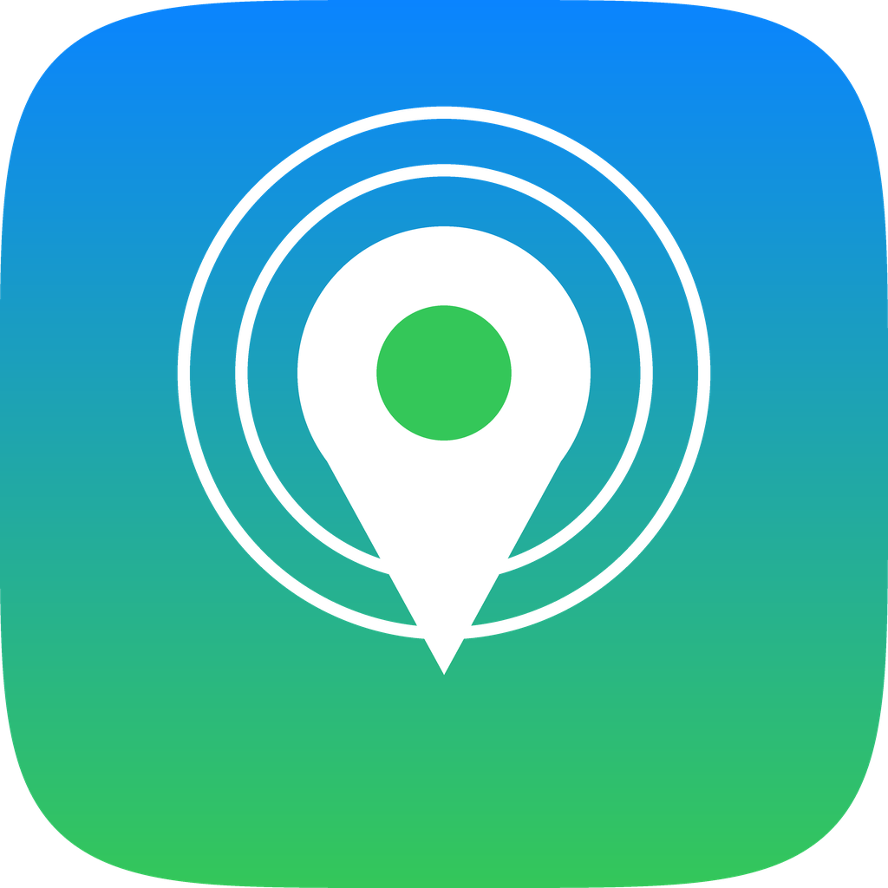
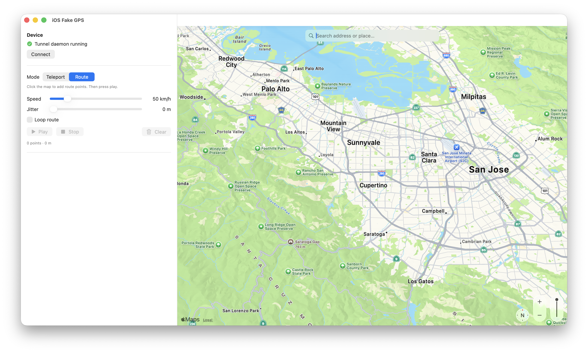

<p align="center">
  
</p>

<h1 align="center">iOS Fake GPS</h1>

<p align="center">A Lockito-style location simulator for iPhone — a clean macOS app.</p>

Set a fixed location **or** play a moving route (with adjustable speed, looping
and GPS jitter) on a **non-jailbroken** iPhone. Everything is driven from a
native macOS app — the iPhone just needs to be plugged in.

This is the iOS counterpart to Android's **Lockito**. Unlike Android, iOS has no
public "mock location" API, so an app installed *on the phone* can't fake GPS for
other apps. Instead the location is driven from a tethered Mac over Apple's
**developer tunnel** — the same mechanism Xcode uses to simulate location while
debugging. Whatever you set is seen **system-wide** by every app on the device.



> **Use responsibly.** This is meant for testing location-aware apps you own and
> for personal use. Using it to defeat anti-cheat, commit fraud, or bypass
> location-based access controls breaks those services' terms — and possibly the
> law.

## Get started

1. Download the latest **FakeGPS-macos-arm64.zip** from the
   [**Releases**](https://github.com/orestislef/ios-fake-gps/releases) page and
   unzip it.
2. Drag **FakeGPS.app** into your **Applications** folder.
3. First launch only: macOS warns it's from an unidentified developer (the app
   isn't notarized). **Right-click the app → Open** and confirm. If it still
   refuses, run once:
   ```bash
   xattr -dr com.apple.quarantine /Applications/FakeGPS.app
   ```
4. Open the app. A short **setup checklist** walks you through the rest — plug in
   your iPhone, start the tunnel, and connect.

That's it. The app has the engine bundled inside it, so **you don't need to
install Python or anything else**, and you never need the Terminal.

### What the checklist asks for

These are the only steps Apple requires a human to do — nothing to download:

- **Connect your iPhone** — plug it in with a USB cable, tap **Trust**, and turn
  on **Developer Mode** (Settings ▸ Privacy & Security ▸ Developer Mode). The app
  shows ✓ the moment it sees the device.
- **Start the secure tunnel** — one button; it asks for your Mac password once
  per session (the tunnel runs as root, which Apple requires).
- **Connect** — links the app to the device. Done.

## Features

- **Teleport** — click the map or search an address to jump the device there.
- **Route playback** — drop waypoints and move along them continuously.
- **Speed control** — 1–300 km/h, with smooth per-second interpolation.
- **Loop** a route indefinitely.
- **GPS jitter** — add a few metres of noise so the track looks natural.
- **Address / place search** powered by MapKit.
- **Live position marker**, plus distance and ETA readouts.
- **Auto-reset on exit** — disconnecting or quitting restores the phone's real
  location automatically, so you're never left on a fake position.

## How it works

```
macOS app (SwiftUI + MapKit)            bundled engine              iPhone
  search / drop pins / route ─────────▶  pymobiledevice3  ──tunnel──▶  every app
  speed · loop · jitter      ◀─────────  LocationSimulation   (DDI)     sees fake GPS
  interpolates the movement              (frozen, inside .app)
```

- The **app** owns the map, route editing and movement interpolation, so speed /
  pause / loop / jitter are all controlled on the Mac side.
- The **engine** is a small Python program (built on
  [pymobiledevice3](https://github.com/doronz88/pymobiledevice3)) frozen into a
  standalone binary inside `FakeGPS.app` — no Python needed on your Mac. It holds
  one developer connection open and applies each coordinate.
- A small **tunnel daemon** (started by the app, as root) opens the developer
  tunnel and mounts the Developer Disk Image. Required on iOS 17+.

## Requirements

- A Mac on **Apple silicon** (the prebuilt app is `arm64`).
- An iPhone on **iOS 17 or newer** with a USB cable and **Developer Mode** on.

## For developers — build from source

The app is a Swift Package (`macapp/`) plus a Python engine (`sidecar/`).

Set up the Python side once (kept in `~/.ios-fake-gps`, **not** `~/Documents`,
because the root tunnel daemon can't read TCC-protected folders):

```bash
./setup.sh
```

Run the app from source:

```bash
cd macapp && swift run        # or open macapp/Package.swift in Xcode and Run
```

Produce the bundled, double-clickable app and a release zip:

```bash
./scripts/build_app.sh        # builds the engine + app -> dist/FakeGPS.app + zip
```

Regenerate the icon:

```bash
~/.ios-fake-gps/venv/bin/python scripts/make_icon.py
iconutil -c icns assets/AppIcon.iconset -o assets/AppIcon.icns
```

### Project layout

```
ios-fake-gps/
├── macapp/Sources/FakeGPS/   the macOS app (SwiftUI + MapKit)
├── sidecar/                  the Python engine + runtime entry point
├── scripts/                  build_runtime.sh, build_app.sh, make_icon.py
├── assets/                   app icon
└── docs/                     screenshots
```

## Command-line use (optional)

The engine inside the app also works from the Terminal. Start the tunnel:

```bash
sudo "/Applications/FakeGPS.app/Contents/Resources/runtime/fakegps-runtime" tunneld
```

Then set a location directly with `pymobiledevice3` (bundled in the app), e.g.
Liberty Island:

```bash
"/Applications/FakeGPS.app/Contents/Resources/runtime/fakegps-runtime" sidecar --list
```

## Troubleshooting

- **App won't open ("unidentified developer")** — right-click → Open, or run
  `xattr -dr com.apple.quarantine /Applications/FakeGPS.app`.
- **Tunnel won't start** — make sure you entered the admin password; the daemon
  needs root. Logs are at `/tmp/ios-fake-gps-tunneld.log`.
- **iPhone never detected** — check the cable, tap **Trust** on the phone, and
  confirm **Developer Mode** is enabled (then reboot the phone).
- **"Could not open LocationSimulation"** — Developer Mode is off or the Developer
  Disk Image hasn't mounted yet; give the tunnel a few seconds after starting.

## Limitations

- The Mac must stay tethered (USB; Wi-Fi works after an initial USB pairing).
- The tunnel runs as root, so it asks for your password once per session — an
  Apple requirement that can't be removed (it's why this can't be an App Store
  app, and why no on-device-only app can do this).
- It sets the reported location only; it doesn't fake Wi-Fi or cell-tower
  signals, so a few apps that cross-check those may notice the mismatch.
